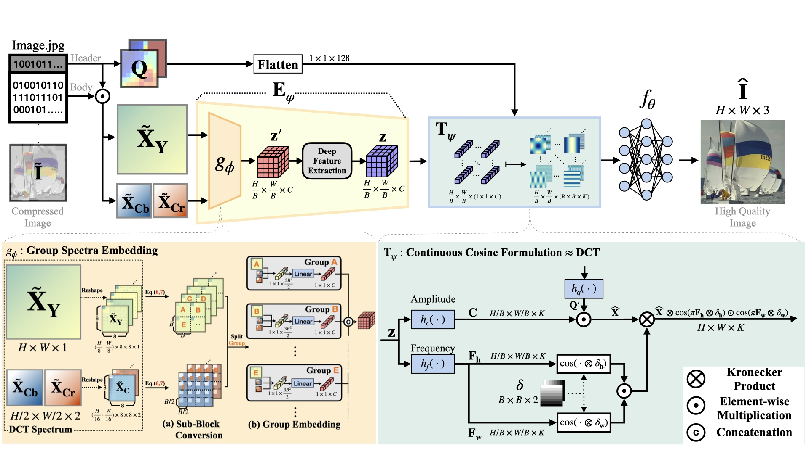

# JDEC: JPEG Decoding via Enhanced Continuous Cosine Coefficient
This repository contains the official implementation for JDEC introduced in the following paper:

[JDEC: JPEG Decoding via Enhanced Continuous Cosine Coefficient (CVPR 2024)](https://openaccess.thecvf.com/content/CVPR2024/papers/Han_JDEC_JPEG_Decoding_via_Enhanced_Continuous_Cosine_Coefficients_CVPR_2024_paper.pdf)


[arXiv](https://arxiv.org/abs/2404.05558)


[Project Page](https://wookyounghan.github.io/JDEC/)


## Overall Structure



JDEC consists of an encoder with group spectra embedding, a decoder, and a continuous cosine formulation. Inputs of JDEC are as follows: compressed spectra and quantization map. Note that our JDEC does not take images as input. JDEC formulates latent features into a trainable continuous cosine coefficient as a function of the block grid and forwards to INR. Therefore, each block shares the estimated continuous cosine spectrum.


## Installation

Our code is based on Ubuntu 20.04, PyTorch 1.10.0, CUDA 11.3 (NVIDIA RTX 3090 24GB, sm86), and python 3.6.

For environment setup, we recommend using [conda](https://www.anaconda.com/distribution/) for installation:

```
conda env create --file environment.yaml
conda activate jdec
```


The encoder module of our JDEC is based on the prior work [RGB No More](https://github.com/JeongsooP/RGB-no-more).

Please refer to the Usage part for installation.

- Compile `dct_manip` -- a modified `libjpeg` handler:

  - Open `dct_manip/setup.py`
  - Modify `include_dirs` and `library_dirs` to include your include and library folder.
  - Modify `extra_objects` to the path containing `libjpeg.so`
  - Modify `headers` to the path containing `jpeglib.h`

  - Run `cd dct_manip`
  - Run `pip install .`


### Data Preparation
Our train and valid sets follow the prior work [FBCNN](https://github.com/jiaxi-jiang/FBCNN), from [DIV2K](https://data.vision.ee.ethz.ch/cvl/DIV2K/) and [Flickr2K](https://www.kaggle.com/datasets/daehoyang/flickr2k) dataset. 
- The following file configurations are required to operate the data loader:
  ```
  jpeg_removal
  ├── train_paired
  │   ├── train_10
  │   │   ├── 0001.jpeg
  │   │   ├──...
  │   ├── train_20
  │   │   ├── 0001.jpeg
  │   │   ├──...
  │   ├── train_30
  │   │   ├── 0001.jpeg
  │   ├── ...
  │   └── train #(GT)
  │       ├── 0001.png
  │       └──...
  └── valid_paired
      ├── valid_10
      │   ├── 0801.jpeg
      │   ├──...
      └── valid
          ├── 0001.png
          └──..
  ```

 

## Train
The basic train code is : 
```
python train.py --config configs/train_JDEC.yaml --gpu 0
```

If you want to modify some configuration (e.g. the range of input bit-depth) modify `.yaml` files and run 
```
python train.py --config configs/FancyConfiguration.yaml --gpu 0
```

We provide our main model's [checkpoint](https://drive.google.com/file/d/1_TLoGHLBtdbPdApRmI0y0YW2nEqnO8Dr/view?usp=sharing).

## Test
The basic test code is : 
```
python test.py 
```
The path to the model checkpoint and benchmark datasets should be changed.

(e.g.`'./PATH_TO_LIVE1'` and `model_path = './PATH_TO_MODEL'`)


## Acknowledgements

This code is built on [LIIF](https://github.com/yinboc/liif),[LTE](https://github.com/jaewon-lee-b/lte), [SwinIR](https://github.com/JingyunLiang/SwinIR) and [RGB No More](https://github.com/JeongsooP/RGB-no-more). We thank the authors for sharing their codes.
```plain

BibTex:
@inproceedings{han2024jdec,
  title={JDEC: JPEG Decoding via Enhanced Continuous Cosine Coefficients},
  author={Han, Woo Kyoung and Im, Sunghoon and Kim, Jaedeok and Jin, Kyong Hwan},
  booktitle={Proceedings of the IEEE/CVF Conference on Computer Vision and Pattern Recognition},
  pages={2784--2793},
  year={2024}
}
```

